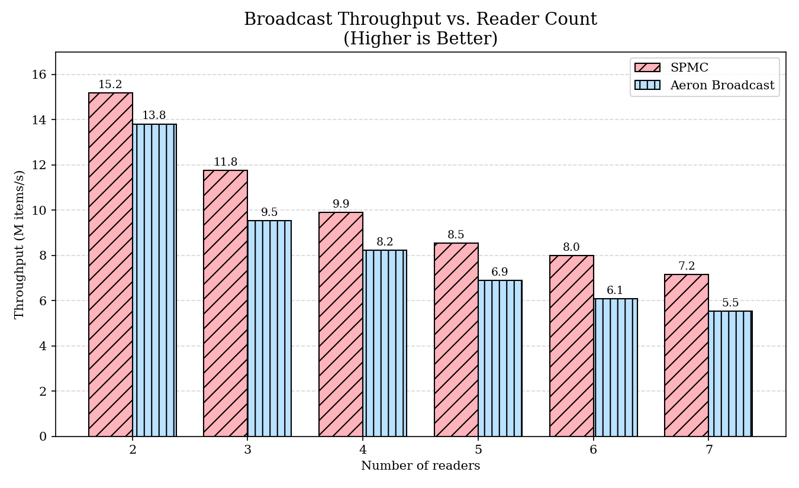

# Inspiration & Credit

[https://www.youtube.com/watch?v=sX2nF1fW7kI] When nanoseconds matter: Ultrafast Trading Systems in C++ - David Gross - CppCon 2024

# Usage:

```cmake
include(FetchContent)
FetchContent_Declare(multiqueues
    GIT_REPOSITORY https://github.com/TrevorSemeraro/MessageQueues.git
    GIT_TAG master)
FetchContent_MakeAvailable(queues)

target_link_libraries(my_app PRIVATE multiqueues)
```

```cpp
#include <multiqueues/spsc.hpp>

using namespace MultiQueues;
// capacity in bytes
//   - power of two
//   - GTE cache line size
SPSC queue{1 << 20}; 

SPSCProducer producer = queue.get_producer();
Order parsed_result;
# encode directly into buffer
uint8_t result = producer.write(sizeof(Order), Order::QueueType, [&](std::span<std::byte> buf) {
    // example: trivially copyable types
    memcpy(buf.data(), &parsed_result, sizeof(Order));
});

SPSCConsumer consumer = queue.get_consumer();
auto res = consumer.read([&](MessageHeader hdr, std::span<std::byte> buf) {
    switch (hdr.type) {
        case Order::QueueType: {
            // read directly from buffer
            Order o;
            std::memcpy(&o, buf.data(), sizeof(Order));
            break;
        }
        ...
        default: throw std::runtime_error("Unexpected header type");
    }
});
```

# Performance:

Cache Line aware counters

For optimal performance in productino environment, use HUGEPAGE's for the ring buffer. at 4Kb default pages, a 2MB (default setting) ring buffer allocates 500 pages. L2 TLB typically holds between 1024 and 2048 entries, meaning it will be evicting roughly 1/4 to 1/2 of the pages in the l2 tlb.

